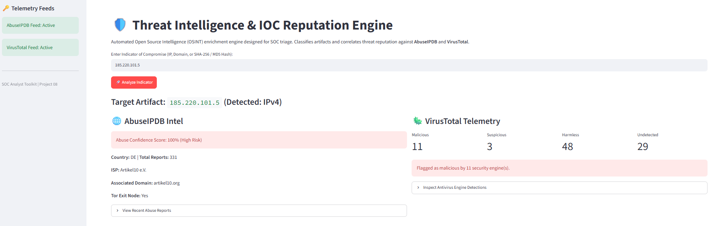
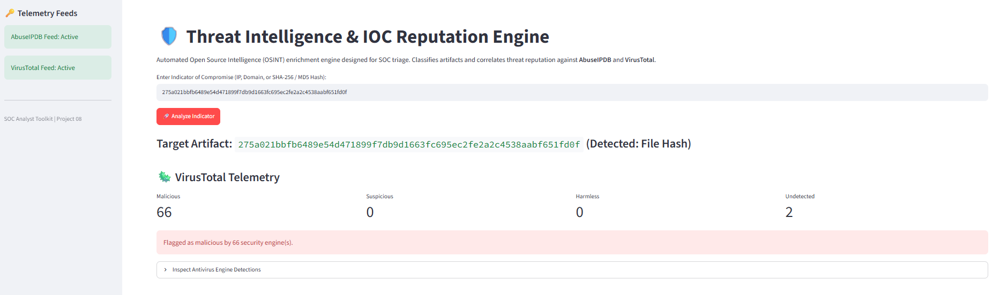

# Threat Intelligence & IOC Reputation Engine

Automated Open Source Intelligence (OSINT) enrichment engine built for SOC analysts and incident responders to classify artifacts and correlate threat reputation across **AbuseIPDB** and **VirusTotal** in real time.

[](https://www.python.org/)
[](https://streamlit.io/)
[](https://www.virustotal.com/)

> 🚀 **Live Demo:** Access the interactive cloud app at https://ianyosho-threat-intel.streamlit.app/

---

## 🛡️ Core Capabilities

- **Automatic IOC Classification:** Heuristic regex parsing engine that dynamically identifies indicator formats:
  - **IPv4 Addresses** (e.g., public exit nodes, malicious hosts)
  - **Domains & FQDNs** (e.g., suspicious C2 domains, phishing infrastructure)
  - **Cryptographic Hashes** (MD5 & SHA-256 binary payloads)
- **AbuseIPDB Correlation:** Queries the AbuseIPDB REST API to retrieve abuse confidence scores, historical reporting frequency, ISP details, autonomous system information, and Tor exit node verification.
- **VirusTotal Multi-Engine Triage:** Interfaces with VirusTotal v3 API to cross-reference artifacts against 70+ endpoint protection and threat intelligence engines, aggregating malicious, suspicious, and benign consensus metrics.
- **Defensive Telemetry Inspection:** Interactive drill-down tables to evaluate specific security engine verdicts and historic incident abuse comments.

---

## 📸 Telemetry & Triage Artifacts

### 1. IPv4 Reputation & Abuse Correlation


### 2. Malicious File Hash & Antivirus Engine Telemetry


---

## ⚙️ Local Setup & Execution

To run this tool locally for security triage, execute the following commands in your terminal:

```bash
# 1. Clone the repository
git clone [https://github.com/IanYosho/08_threat-intel-ioc-lookup.git](https://github.com/IanYosho/08_threat-intel-ioc-lookup.git)
cd 08_threat-intel-ioc-lookup

# 2. Configure virtual environment
py -m venv venv
.\venv\Scripts\activate

# 3. Install dependencies
pip install -r requirements.txt

# 4. Set up API credentials
# Create .streamlit/secrets.toml and define:
# ABUSEIPDB_API_KEY = "your_key"
# VIRUSTOTAL_API_KEY = "your_key"

# 5. Launch the application
streamlit run app.py

🛠️ Tech Stack
Framework: Streamlit

Language: Python 3

Libraries: requests, pandas

Threat Feeds: AbuseIPDB API v2, VirusTotal API v3